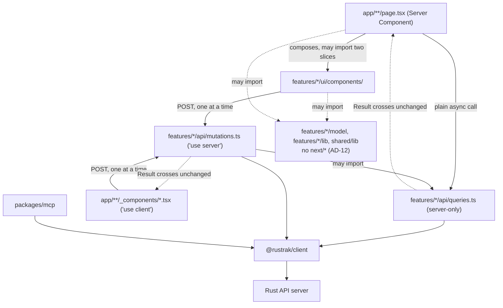
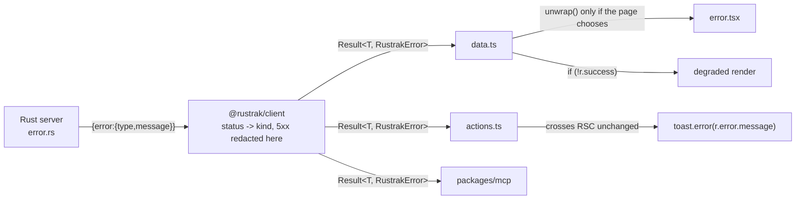

# Architecture Spine - Rustrak Frontend and Client Contract

## Design Paradigm

**Feature slices over a typed client, with three layers and a portable core.**

`@rustrak/client` is the architectural boundary. It owns the API contract (Zod schemas), the transport implementation (ky), and the DTOs (~120 inferred types). Nothing in `apps/webview-ui` re-models, wraps, or inverts it. A hexagonal or clean-architecture split was evaluated in depth and rejected: with the contract, the implementation and the DTOs already inside a first-party, lockstep-versioned package, a `domain/` folder would hold re-exported client types and an `infrastructure/` folder would hold one-line delegations. Seven production Next.js App Router dashboards were cloned and inspected to test this; none has such a split. That decision stands.

> **Revised after AD-10 phase 6.** This section previously read "No layered architecture", declared "no abstraction axis", and named a role vocabulary of `data.ts`, `actions.ts`, `components/` and `hooks/`. All three are now false, and the rewrite is deliberate rather than a drift. The `data.ts`/`actions.ts` split divided code by **coupling to Next** rather than by meaning: it separated "what a Server Component calls" from "what the browser calls", a boundary that evaporates if the framework changes. What replaced it is below, and AD-6, AD-7 and AD-12 carry the detail.

`apps/webview-ui/src/` has three axes:

- **Layer on the outside.** `app/` -> `features/` -> `shared/`. A layer imports only from layers strictly below it, never upward.
- **Slice in the middle.** `features/<slice>/` per bounded context. A slice never imports a sibling slice; when a screen needs two, the **page** composes them.
- **Segment on the inside**, from a closed vocabulary: `ui/` (with `components/` and `hooks/` beneath it), `api/`, `model/`, `lib/`, and `config/` in `shared` only.

**There is now an abstraction axis, and it is the point.** `features/*/model`, `features/*/lib` and `shared/lib` may not import `next/*` at all. That is the portable core: the logic that is expensive to rewrite and cheap to keep, defined by what it must not depend on. Measured before phase 6, 90 of 189 files already imported nothing from `next/*` and another 44 touched only `next/link` and `next/navigation`; the rule turns that accident into a property.

The boundary sits between `app/` and `src/` rather than at full framework independence, and that was measured, not assumed. Making the remaining structurally-coupled files portable means moving reads to the browser, which this deployment cannot do: `apps/server` serves `Cors::default().allow_any_origin()` **without** `supports_credentials()`, so a browser refuses to send the session cookie, and `RUSTRAK_API_URL` is server-side by design. Full independence is a product and security decision, not a refactor. See Deferred.

`src/app/` contains routes and their composition. It composes; it does not fetch through indirection and it holds no derived logic. Everything under it that is not a Next special file lives in a `_components/` folder.

## Invariants & Rules

### AD-1 - `@rustrak/client` returns `Result`, it does not throw

- **Binds:** all
- **Prevents:** every consumer having to discover at runtime which exceptions a method can raise, and the resulting mix of unguarded call sites and defensive `try/catch` that neither the compiler nor a reviewer can tell apart. Also prevents the class of bug in gh-204, where an exception crossing the React server/client boundary loses its message.
- **Rule:** every public method on every resource returns `Promise<Result<T, RustrakError>>`. A `throw` from the client is reserved for programming errors (malformed `baseUrl`, a bug in the client itself), never for an expected outcome. Expected outcomes are: any HTTP status the server can return, a transport failure, and a response that fails its own schema. This is a breaking change to a published package, taken deliberately while the product is pre-1.0.

### AD-2 - One `Result` type, a plain object, crossing every boundary unchanged

- **Binds:** all
- **Prevents:** a second result type appearing at the React boundary, and with it a conversion function, a mapping table, and two vocabularies for the same idea. Also prevents adopting a class-based result (`ts-results`, `ts-results-es`, `neverthrow`), which cannot cross that boundary at all: React checks the prototype and throws `"Only plain objects, and a few built-ins, can be passed to Client Components. Classes or null prototypes are not supported."`
- **Rule:** `Result<T, E>` is defined once in `@rustrak/client` as a plain discriminated union with no methods:

  ```ts
  export type Result<T, E> =
    | { readonly success: true;  readonly data: T }
    | { readonly success: false; readonly error: E };
  ```

  The discriminant is `success` and the payload is `data`, mirroring Zod's `safeParse` exactly, because the app runs Zod on every form and two near-identical shapes in one file is a defect. A method with nothing to return is `Result<void, E>` with `data: undefined`, never a bare `Result<never, E>` or a boolean. Operations on a `Result` are standalone exported functions (`Ok`, `Err`, `unwrap`, `unwrapOr`, `mapResult`), never methods. Every field is `readonly`. No value placed inside a `Result` may be a class instance or carry a non-`Object` prototype.

### AD-3 - Errors are one closed discriminated union, and 5xx never carries a server message

- **Binds:** all
- **Prevents:** three failures at once. A non-exhaustive error mapping, which the current client has (`transformHttpError` has a `default:` branch returning a bare error with only a status, silently swallowing 409 and 422 into an unhandled shape). A misleading name, which the current client also has (`ValidationError` means "our own response schema failed to parse", not "the user's input was rejected"). And internal detail reaching a user, which happens today because `apps/server/src/error.rs` serialises `self.to_string()` for every variant including `Database(#[from] sqlx::Error)`, putting column and constraint names in the HTTP body.
- **Rule:** `RustrakError` is a closed union keyed on `kind`, exported from `@rustrak/client`:

  ```ts
  export type RustrakError =
    // mirrors apps/server/src/error.rs AppError, verified variant by variant
    | { kind: 'validation';        status: number; message: string }  // AppError::Validation -> 400
    | { kind: 'unauthenticated';   status: number; message: string }  // 401
    | { kind: 'forbidden';         status: number; message: string }  // 403
    | { kind: 'not_found';         status: number; message: string }  // 404
    | { kind: 'conflict';          status: number; message: string }  // 409
    | { kind: 'gone';              status: number; message: string }  // 410, invitation flows
    | { kind: 'payload_too_large'; status: number; message: string }  // 413
    | { kind: 'rate_limited';      status: number; message: string; retryAfter?: number }
    | { kind: 'client_error';      status: number; message: string }  // any other 4xx
    // local and transport failures, no server status
    | { kind: 'invalid_request';   message: string }  // caller input rejected before the call
    | { kind: 'server_error';      status: number; message: string; incidentId?: string }
    | { kind: 'network';           message: string }
    | { kind: 'invalid_response';  message: string };
  ```

  The union **mirrors the server's `AppError` enum**, not a generic HTTP taxonomy. `AppError::Validation` maps to **400**, not 422, so there is no 422 member; `PayloadTooLarge` emits **413**; `410` is already branched on in the invitation flow. `status` is `number`, never a literal type, and `client_error` is the catch-all, so a status nobody anticipated has a home instead of being unrepresentable. `invalid_request` covers the 17 sites across 9 resources that validate the caller's own input before issuing a request; those never reach the network and have no status. **Any other I/O in `apps/webview-ui` uses this same union**, not an ad-hoc shape: `version-check.ts` fetches a GitHub Pages feed directly and must return `Result<UpdateInfo, RustrakError>` like everything else, so a caller never has to know which backend a failure came from. A non-JSON or unparseable error body maps to `client_error` or `server_error` by status with the generic message; it is never surfaced verbatim.

  **The nine existing error classes are deleted.** `RustrakError` is today an exported class and the base of a nine-class hierarchy re-exported from `packages/client/src/index.ts`, used as a runtime value in `packages/mcp/src/errors.ts`, in four `apps/webview-ui` action files, and in five `instanceof` branches in `apps/docs/content/sdks/client.mdx`. The name is reused for this union and the classes go, in one breaking change with no deprecation period. Every one of those call sites, the docs page, and `packages/client/README.md` (which ships to npm teaching the throwing API) are named deliverables of the change, not follow-up.

  Redaction happens **inside the client, at construction**, and is keyed on the `kind`, never on a status:

  - `server_error` discards the server's message entirely and substitutes a fixed generic string. The detail never reaches the client; the Rust server logs it and emits a correlation id, surfaced as `incidentId`.
  - `network` carries **no `cause`**. Node's undici cause strings embed the resolved address (`ConnectTimeoutError ... attempted address: 10.55.44.33:8081`), which would publish the internal API host and port to any browser.
  - `invalid_response` carries **no Zod issues**. A `ZodIssue` embeds the offending path and value, which is response data. Issues are logged where the parse fails and never cross the wire.

  Every consumer is therefore protected, including `packages/mcp` and any external installer, and the `error.rs` fix becomes defence in depth rather than the only barrier. Mapping from HTTP status to `kind` is keyed on the status code, never on a class or an `instanceof` check, and must be exhaustive over the union.

  **A domain-meaningful absence is not an error.** An empty list is `success: true` with an empty array; "no current user" is `success: true` with `data: null`. `success: false` is reserved for a failure to obtain an answer. This binds the six existing degraded-fallback functions (`getSessionSummary`, `getSessionTimeseries`, `getNewIssuesForRelease`, `getServerVersion`, `getUpdateInfo`, `getCurrentUser`), whose fallbacks are deliberate and are preserved by widening the success type rather than by catching. A widened success value must represent a REAL absence (`null`, `[]`, zero items) and never a fabricated one: today's `EMPTY_SESSION_SUMMARY` returns zeroes that render identically to a genuine all-zero window, which is a lie the type system cannot see. Where that distinction matters to the reader, absence is modelled explicitly as `data: null` rather than as a zeroed record. `getCurrentUser` is the sharpest case: its "null means logged out" contract gates auth across 32 server files, and a wrong branch there is invisible to both the compiler and `next build`.

### AD-4 - Throwing is a local decision, never a layer policy

- **Binds:** all of `apps/webview-ui`
- **Prevents:** a blanket rule in either direction. Making every layer throw reintroduces gh-204. Making nothing ever throw forfeits `error.tsx` as an automatic boundary for the 28 pages under `(main)` that rely on it.
- **Rule:** no module is designated as throwing or non-throwing. `api/queries.ts` and `api/mutations.ts` both return `Result`, and neither may contain a `try/catch` or a call to `unwrap`. A page or Server Component that wants a failure to reach its nearest `error.tsx` calls `unwrap(result)` at that call site, deliberately and locally. A page that wants a degraded render narrows with `if (!result.success)` instead. Because `Result` is a discriminated union, reading `.data` without narrowing is a compile error, so a forgotten check cannot produce a silently broken render.

  **`unwrap` is confined to `src/app/`.** Calling it inside `mutations.ts` would throw across the RSC boundary and reproduce gh-204 exactly, and a declared-return-type rule would not catch it, because an action that throws still declares `Promise<Result<...>>`. **Both of those rules are among the four this spine enumerated and never built** -- see Knowingly unchecked; today this paragraph is a convention held by review rather than by CI.

  `unwrap` throws a real `Error` subclass, never the plain union object: React error boundaries expect an `Error`, and a plain object would not reach `error.tsx` at all. The thrown instance carries the `RustrakError` on a property for server-side logging. React redacts its message on the way to the browser regardless, which is accepted: `error.tsx` is a "something went wrong" page, and the recoverable detail is the `incidentId`, not the message. Any `try/catch` elsewhere in `apps/webview-ui` must open with `unstable_rethrow(error)`, or it will swallow the `DynamicServerError` that `cookies()` raises during static generation, along with `redirect()` and `notFound()`.

### AD-5 - The direction of the call decides the file, and the compiler enforces it

- **Binds:** all of `apps/webview-ui`
- **Prevents:** every one of the 85 functions exported from the 18 `'use server'` files being **published as an HTTP endpoint any client can POST to**, when only those actually invoked from a browser event need to be. Marking a function `'use server'` registers a server reference and mints a stable action id; a read that only ever serves a Server Component gains nothing from that and pays for it in attack surface. Also prevents gh-204's two populations, the client-called and the server-called, drifting apart as a matter of discipline. (gh-204 states 81 actions against the 85 currently exported; the rule set produces the authoritative count as a side effect of running.)
- **Rule:** placement follows who initiates the call, not what the function does.

  | File | Directive | Initiated by | Endpoint published |
  | --- | --- | --- | --- |
  | `features/<slice>/api/queries.ts` | `import 'server-only'` | a Server Component render | no |
  | `features/<slice>/api/mutations.ts` | `'use server'` | a browser event | yes |

  `import 'server-only'` is not a directive; it is a build-time poison pill that makes inclusion in the client module graph a **compilation error**. It requires no dependency: Next.js 16 handles `server-only` and `client-only` internally and ships their type declarations, and the npm packages' contents are unused. The flat `src/actions/` directory was **deleted** and its 85 exports redistributed by the same test, who initiates the call. No `'use server'` survives outside `features/*/api/mutations.ts`, machine-checked by `use-server-placement`, which also requires that an `api` segment hold exactly those two filenames and that each carry its own directive -- the segment check alone was not enough, and the `storage` slice proved it by shipping one directive over both its reads and its writes. `mutations.ts` may import `queries.ts`; the reverse is forbidden. For the one function needed by both populations (`listTeam`), the implementation stays in `queries.ts` and `mutations.ts` declares a thin async function delegating to it; this is sanctioned, not an exception. An action that reuses a read declares its own async function rather than re-exporting one. Whether a given re-export survives depends on which layer is checking (the SWC transform and the TypeScript plugin do not agree), so this is a convention held by rule (3), not an inference from the compiler.

### AD-6 - `src/app/` is routes and composition only, and nothing sits loose in it

- **Binds:** `apps/webview-ui/src/app`
- **Prevents:** route folders accumulating files with no stated rule, so no one can tell a route-private component from one that should be shared. The original version of this AD carried a six-component threshold, and the threshold is precisely what failed: sixteen components had accumulated loose beside their `page.tsx` in folders that all contributed routes, and the rule reported success the whole time because it was written about *folders* rather than about files.
- **Rule:** every folder directly under `app/` is a real route segment, a route group `(name)`, a parallel-route slot `@name`, or a private `_`-prefixed folder. **Every file that is not a Next special file sits in a `_components/` folder, unconditionally and with no size threshold** -- one component beside a page is as much a violation as eleven, because a threshold is a judgement call and judgement calls rot. A `_`-prefixed folder never sits at the bare `app/` root; the root route uses a route group instead. `app/` holds no API segment and no derived logic. Every Route Handler lives under `app/api/`, which Next.js requires to the extent that a `route.ts` may not share a segment with a `page.tsx`. There are no Route Handlers today.
- **Placement test**, applied to a component and answered by its props, never by who imports it: props naming one domain type (`Issue`, `Project`, `ReleaseHealthRow`) mean it belongs to that feature's `ui/components/`, however many routes render it. Props naming *several* features mean it is composition and stays in the route's `_components/`. Props of only primitives and `ReactNode` mean it is a primitive and belongs in `shared/ui/components/`.

### AD-7 - Segments, not roles: `ui`, `api`, `model`, `lib`, `config`

- **Binds:** `apps/webview-ui/src`
- **Prevents:** the folders that group by what a file *is* rather than what it is *about*. The original `src/lib/` held 215 lines of ported Sentry algorithms beside a 1370-line table of SDK snippets; `src/hooks/` grouped files by their React shape; `src/components/` by their React shape again. The replacement this AD originally proposed, `src/content/` for static tables, was never built and is **not** the rule: static data lives in `shared/config/`.
- **Rule:** a slice's inside is a closed segment vocabulary.
  - `ui/` holds everything that renders or hooks, and is itself divided by kind: `components/`, `hooks/`, and `utils/` or `stores/` when a first file of that kind exists. **Nothing sits at a `ui/` root.** `shared/ui/components/shadcn/` holds the CLI-generated kit, kept apart from hand-written primitives.
  - `api/` holds exactly `queries.ts` and `mutations.ts`; see AD-8.
  - `model/` holds types and domain logic. `lib/` holds derived logic. Neither may import `next/*`; see AD-12.
  - `config/` exists in `shared` only, and holds static tables together with the lookup functions that read them.
- **Admission test**, applied per file: **does it run with nothing mocked?** If yes it is derived logic and belongs to a slice's `model` or `lib`. If no it is glue, and glue with no domain meaning goes to `shared/lib`. The test is necessary but not sufficient: it says a file is *not* glue, and the segment vocabulary above says where it then goes.
- A threshold or constant carrying business meaning is defined exactly once and imported, never restated in a second function.
- **No barrel files, ever.** Every import names the file it wants (`@/features/issue/ui/components/issues-list`), never a slice root. This is not style: a barrel re-exporting both `api/queries.ts` (`server-only`) and a `'use client'` component drags the server-only poison pill into every client component that imports anything from the slice. It was tried on the `issue` pilot and the build failed with 11 errors. Two barrels, one client-safe and one server-only, is worse than none. The **segment** is the public boundary; the accepted cost is that internals are not private, so renaming a file inside a slice touches its importers.

### AD-8 - Reads go straight to the source from Server Components

- **Binds:** `apps/webview-ui`
- **Prevents:** the current pattern, where Server Components read through Server Actions. Next.js dispatches Server Actions **one at a time per client** and queues them, so using them for reads serialises requests, and the docs are explicit that a prerendered component fetching through a Route Handler **fails the build**.
- **Rule:** a Server Component calls its slice's `api/queries.ts` directly as a plain async function. Reads never go through `'use server'`, never through a Route Handler, and never through a client-side fetch. Mutations initiated in the browser go through `api/mutations.ts` and are followed by `router.refresh()`.
- **The two directives are not interchangeable, and each owns a filename.** `queries.ts` opens with `import 'server-only'`, a build-time poison pill making the module unreachable from the browser bundle. `mutations.ts` opens with `'use server'`, which turns every export into a public POST endpoint. Marking a read `'use server'` costs an endpoint and buys nothing; the `storage` slice shipped exactly that defect, one directive over both its reads and its writes, and it passed the rule as originally written because the rule only asked that the directive sit in an `api` folder. **The split is by who calls it, not by what it does to the database:** a dry-run preview that mutates nothing belongs in `mutations.ts` when a `'use client'` component invokes it, because a `server-only` module is not reachable from there.
- The filenames were `data.ts` and `actions.ts` until AD-10 phase 6. That split carried the architecture in the filename because it divided code by coupling to Next; now the **segment** carries it, and the filename is free to say what the functions do.

### AD-9 - The rules above are machine-checked, and each check proves it can fail

- **Binds:** all
- **Prevents:** the rules decaying into documentation. Also prevents the specific failure that bit the reference project this design is adapted from, where two architecture rules passed vacuously for months because a library field silently had its extension stripped. A secondary and explicit goal: a failing named test is a deterministic signal an AI coding agent consumes and corrects against, where a linter warning tends to be sanded off.
- **Rule:** `apps/webview-ui` gains a test runner and an `src/__tests__/architecture/` suite, one file per concern, run by `pnpm test` and therefore by `pnpm ci` with no CI file changes. Every rule asserts **two** things: that the matched population exceeds a floor, and that the violation set is empty. The floor is a **specific expected count committed in the test**, never `> 0`, because a floor of zero-plus is itself vacuous: it passes when a glob typo matches one file out of eighty. When the real count changes, the floor is updated in the same commit as a deliberate act. A rule that cannot assert its population is not written, whatever the mechanism, and this holds even where the tool offers its own empty-test protection, because that protection is known not to cover predicate rules. Before a rule is trusted, a deliberate violating fixture is added, the suite is confirmed to fail with a clear message, and the fixture is removed; a rule that has never been seen to fail is not considered delivered. The rule set is deliberately smaller than the reference project's; see Consistency Conventions for the enumerated checks, the mechanism assigned to each, and what is knowingly left unchecked.

### AD-10 - The conversion lands behind a staging seam, never as one flip

- **Binds:** all
- **Prevents:** the only reading of AD-1 through AD-5 that is otherwise available: a single unreviewable commit touching 86 client methods, 349 client tests, 64 `packages/mcp` call sites and roughly 120 UI files at once. Turborepo places `packages/client` and `apps/webview-ui` in one build graph, so there is no green intermediate by default. Also prevents two agents migrating different features from producing mutually incompatible intermediate states.
- **Rule:** the conversion proceeds in ordered phases, each ending with `pnpm ci` green.
  1. **Enable the gate.** `apps/webview-ui` gains `test`, `lint`, `format:check` and `check-types` scripts and a vitest config. Until this lands the app has no CI gate but `next build`, so nothing after it is verifiable.
  2. **Realign the fixtures.** `packages/client` `tests/mocks/handlers.ts` carries 50 error responses, all 4xx, and **50 of 50 use the flat `{error:'...'}` shape while zero use the nested shape the server actually sends**. That mismatch is why gh-204's `[object Object]` bug survived a 97 percent-covered suite. Realigning the fixtures, and adding 5xx and `retryAfter` cases, is a prerequisite to trusting any later phase, not Deferred work.
  3. **Add the seam additively.** `Result`, the `RustrakError` union, and an internal `attempt<T>(promise): Promise<Result<T, RustrakError>>` are introduced alongside the existing behaviour. Throughout this phase the client still throws, but it throws an `Error` **subclass carrying the plain union on a property**, because ky's `beforeError` hook and React error boundaries both require a real `Error`. Both call styles work; nothing breaks.
  4. **Convert resource by resource**, each with its tests, each a reviewable commit.
  5. **Flip and delete.** Throwing is removed, the nine error classes are deleted, and `packages/mcp`, `apps/docs/content/sdks/client.mdx` and `packages/client/README.md` are updated in the same change.
  6. **Restructure `apps/webview-ui`** slice by slice, adding each architecture rule with its deliberately failing fixture as the rule's own slice lands.

  A phase may not begin before its predecessor is green. Structural migration (phase 6) never interleaves with contract migration (phases 3 to 5).

  **All six phases are landed.** Phase 6 shipped as a stack of four PRs collapsed into one before reaching `main`, so a single verified tree was merged rather than three intermediate states that CI had never seen -- the gate only fires on a PR based on `main`, which is what made the stacked form unverifiable. It also revised this spine: AD-6 and AD-7 were rewritten, AD-12 added, and the Cross-feature imports convention reversed.

### AD-11 - Every action re-authorizes; being reachable is not being permitted

- **Binds:** `features/*/api/mutations.ts`
- **Prevents:** AD-5 arguing from attack surface while leaving the 35 endpoints it deliberately keeps unguarded. A Server Action is a public POST endpoint whose arguments are attacker-controlled; the fact that the only UI that calls it is rendered behind an auth check proves nothing, because the endpoint is reachable without that UI.
- **Rule:** every exported action performs its own authentication and authorization against the session, on every call, regardless of what the calling component does. Render-time gating is not a security boundary. Ownership arguments that arrive as parameters (`projectId`, `issueId`, `teamId`) are verified against the session's own permissions, never trusted. In practice the Rust server is the enforcement point and the action's duty is to pass the session and to surface `unauthenticated` or `forbidden` faithfully rather than swallowing it; an action that reaches the server without the session is the defect this prevents.

### AD-12 - Layers point downward, slices never point sideways, and the core does not know Next

- **Binds:** `apps/webview-ui/src`
- **Prevents:** the three failures that the slice structure of AD-6 and AD-7 makes *possible* but does not itself prevent. A tree can have perfect folder names and still be a web. Specifically: `shared/` reaching up into a feature, which makes the shared layer unusable without the domain; eleven slices importing each other, which still points downward and still means touching `issue` can break `release`; and domain logic importing `next/*`, which silently ends the portability the phase was for.
- **Rule:** three constraints, all enforced by tests, none negotiable.
  1. **Layer direction.** `app/` -> `features/` -> `shared/`. `shared` imports neither `features` nor `app`; `features` does not import `app`. The other direction is free: 102 files under `app/` import from `features/`, and that is the intended flow.
  2. **Slice isolation.** A slice never imports a sibling slice. When a screen needs two features, the **page** composes them -- `app/` is above both and may import both, so composition has a home that costs no permanent edge. Two slices sharing a *word* is not a violation: `agent-trace` and `transaction` both speak of spans and mean different types. Two slices genuinely needing one type is resolved by moving the type **down** into `shared`, never sideways.
  3. **Portable core.** `features/*/model`, `features/*/lib` and `shared/lib` may not import `next/*`. `ui` segments and `app/` are deliberately exempt: components use `useRouter` and `Link`, and pages are the coupled edge by design.
- **This supersedes the previous Cross-feature imports convention**, which read "Permitted, and one-directional per concept" and allowed `features/a` to import `features/b` so long as no cycle formed. That was the right call for eighteen flat modules and is the wrong one for eleven slices: a one-directional web is still a web, and "no cycles" is a far weaker property than "no edges". The concept-ownership half survives -- a concept still has exactly one owning slice and a type is never duplicated -- but the resolution is now downward into `shared`, not a sideways import.
- **Mechanism note.** Constraints 1 and 2 are the only rules in the suite that need a real import graph, and archunit's `dependOnFiles` resolves one through the TypeScript program. A content regex cannot follow a `@/` alias to the file it lands on, so it would have to trust that the alias means what its name suggests. Constraint 3 is a content predicate because `next` is an external package with no node in that graph to point at.



## Consistency Conventions

| Concern | Convention |
| --- | --- |
| Result shape | `{ success: true; data: T } \| { success: false; error: E }`. Discriminant `success`, payload `data`, mirroring Zod `safeParse`. All fields `readonly`. Never a class. See AD-2. |
| Error shape | One closed union keyed on `kind`, defined once in `@rustrak/client`. No consumer invents an error string or a code. See AD-3. |
| Naming - files | kebab-case. Biome configures `useFilenamingConvention` at error level. **At the time this spine was written no script in the repo invoked Biome**: the root `lint` task fanned out to per-package `lint` scripts and only `apps/server` defined one, so the convention was unenforced in CI. AD-10 phase 1 closes that by adding `lint` and `format:check` to `apps/webview-ui`; from that phase on, this row describes something the pipeline actually enforces. Next.js special filenames are the standing exception. |
| Naming - segment files | `api/queries.ts` and `api/mutations.ts` verbatim, and an `api` segment holds nothing else. Was `data.ts`/`actions.ts` until AD-10 phase 6; see AD-8 for why the segment now carries the architecture instead of the filename. Everything else in a slice is named for what it does. |
| Naming - slices | Singular, one folder per bounded context. **Eighteen flat modules became eleven slices**, because several were the same concept seen from a different angle: `stats` folded into `project` (aggregates *of a project*), `sessions` into `release` ("release health" *is* sessions grouped by release), and `auth`, `team`, `members` and `invitations` into `user` (all four are people and their access). `alert` owns rules and integrations together, since a rule without an integration does nothing. `transaction` is the slice; `performance` is only a route segment. `agent-trace` and `transaction` both speak of spans and mean different types, so neither owns the other. |
| Derived logic vs glue | Admission test: does it run in a test runner with nothing mocked? See AD-7. |
| Static data | `shared/config/`, together with the lookup functions that read it. The originally proposed `src/content/` was never built and is not the rule. |
| Mutation feedback | `useTransition` plus `router.refresh()`. `useActionState` is not used: it types exactly one payload parameter, while the actions here are multi-argument and typed, and adopting it would force every action into a `FormData` bag or a curried wrapper. `ActionResult` is nonetheless a valid `useActionState` state, so a single form may adopt it later for progressive enhancement without changing anything global. |
| Forms | react-hook-form with a Zod resolver. A server error with no field goes to `setError('root.serverError', ...)`, which react-hook-form clears on the next submit and which cannot collide with a real field name. |
| Cross-slice imports | **Forbidden.** Superseded by AD-12; this row previously permitted them so long as no cycle formed, which is a far weaker property than no edges at all. A concept still has exactly one owning slice and a type is still never duplicated, but when two slices need one type it moves **down** into `shared`, and when a screen needs two slices the **page** composes them. |
| Shared placement | Decided once, so a migrating agent does not have to. **A component's home is decided by the type it renders, not by who imports it** (AD-6). Pure logic with no domain meaning goes to `shared/lib` (`clipboard.ts`, `utils.ts`, `chart-format.ts`); carrying domain meaning it stays with its owning slice (`session-health.ts` in `release/model`). A component whose props are only primitives goes to `shared/ui/components/`; the shadcn kit sits apart in `shared/ui/components/shadcn/`. A hook with no domain goes to `shared/ui/hooks/` (`use-mobile.ts`) -- **not** to `lib`, which would leave that segment meaning two things and quietly unportable, since a hook passes the `next/*` rule while being pure view. Client construction and the cookie adapter are `shared/api/rustrak.ts`. |
| Observability | AD-3 destroys the 5xx message by design, so it must be recoverable elsewhere. `apps/server` logs the full error and emits a correlation id on every 5xx; `@rustrak/client` surfaces it as `incidentId` and the UI renders it beside the generic message (`"... (ref: a1b2c3)"`). `invalid_response` logs its Zod issues where the parse fails. Without this the redaction trades a leak for a blind spot. |
| Errors surfaced to users | `toast.error` with `error.message`, which is now always safe to render because AD-3 redacts at the source. Never `err.message` from a caught exception. |
| Layer enforcement | Machine-checked, nine rule files and 35 assertions under `src/__tests__/architecture/`, every one on archunit. `import 'server-only'` remains the primary mechanism for the browser boundary and is a build error, not a test. The suite covers what the compiler cannot: **`layer-direction`** (`shared` reaches neither `features` nor `app`; `features` does not reach `app`); **`slice-isolation`** (no slice imports a sibling); **`portable-core`** (`features/*/model`, `features/*/lib`, `shared/lib` import no `next/*`); **`no-barrel-files`** (no `index.ts` or `index.tsx` under `src/`); **`app-folder-shape`** (no file loose under `app/` outside `_components/`, and no `_` folder at the bare `app/` root); **`ui-segment-shape`** (nothing at a `ui/` root, and the kind folders are a closed list); **`use-server-placement`** (an `api` segment holds exactly `queries.ts` with `server-only` and `mutations.ts` with `'use server'`, and the directive appears nowhere else); **`result-shape`** (no `success: false` literal outside `@rustrak/client`); **`client-error-kinds`** (the error `kind` allowlist, enforced at compile time by `satisfies` rather than at runtime, which is the stronger reading: a type error cannot be skipped and `it.skip` can). |
| Knowingly unchecked | Stated rather than pretended. **Four rules this spine originally enumerated were never built**, and naming them is the point of this row: the return-type rule via the TypeScript compiler API (every export in an action module assignable to `Promise<Result<...>>`); `queries.ts` never imports `mutations.ts`; `@rustrak/client` imported only from `api` segments with type-only imports excepted -- measured on the current tree, this holds but for two value imports of `Ok`, which is a `Result` constructor rather than a transport call, so the rule is cheap and worth building; and the `unwrap`/`try/catch` rule, deferred by decision rather than oversight. Also unchecked: whether a Client Component renders a message meaningfully; whether the semantically correct `kind` was chosen for a given status; whether the Rust server's 4xx bodies are free of internal detail, which is the server's to own. Deliberately **not** written: "no Server Component imports from an action module", because a page legitimately imports an action to forward it as a prop, and an import graph cannot distinguish calling from forwarding without dataflow analysis. |
| Architecture-test tooling | `archunit` 2.4.0 under vitest, and **every rule is on it** -- selection, population count and verdict all go through `projectFiles()`. The suite previously counted files with a `node:fs` walk of its own and used archunit only for the assertion, which is two different answers to "which files are in this project" and lets a rule's population and its verdict disagree in silence; the shared helper is now two pure string predicates that touch no disk. `dependOnFiles` resolves a real import graph through the TypeScript program and is what the two graph rules need: a content regex cannot follow a `@/` alias to the file it lands on. Two archunit defects are mitigated rather than assumed away: `FileInfo.name` strips only the LAST extension, so `name.endsWith('.test.ts')` is never true and such a rule passes vacuously forever -- test exclusion is therefore matched on `path`; and `allowEmptyTests` misfires on negative dependency rules. AD-9's population floor is the mitigation for both and is mandatory on every rule. **Every negative rule carries a positive control**, because a negative passes just as happily when the analyzer resolved nothing at all: `layer-direction` asserts the `app`->`features` edge set is at least 90 (it is 102). Vitest runs with `isolate: false` and `fileParallelism: false` so the graph is extracted once rather than once per rule file; that is a 20x reduction in work, and the isolated default cost 32s of CPU and failed CI on a 2-core runner while passing locally on 7 cores. |
| Dependency pinning | Exact versions, no caret or tilde, per standing repo policy. |
| Versioning | Lockstep across the release group. The `Result` change is a `minor` changeset, never `major`, per the 0.x convention. |

## Stack

| Name | Version |
| --- | --- |
| Next.js | 16.2.10 `[ADOPTED]` |
| React | 19.2.7 `[ADOPTED]` |
| TypeScript | 6.0.3 `[ADOPTED]` |
| Tailwind CSS | 4.3.2 `[ADOPTED]` |
| Zod | 4.4.3 `[ADOPTED]` |
| ky | 2.0.2 `[ADOPTED]`, sealed inside `@rustrak/client`. Already on ky 2 APIs (`isHTTPError`, `error.data`, `prefix`) |
| react-hook-form | 7.81.0 `[ADOPTED]` |
| Biome | 2.5.4 `[ADOPTED]`, monorepo root |
| vitest | 4.x, new to `apps/webview-ui`, matching `packages/client` and `packages/mcp`. Requires `test.globals: true` and `"types": ["vitest/globals"]` for archunit's `toPassAsync` matcher |
| archunit | 2.4.0, architecture tests only. Single maintainer, ~42k downloads/week; adopted deliberately for consistency with the reference project and for deterministic agent feedback, with the two defects named in Consistency Conventions mitigated |
| TypeScript compiler API | **Not adopted.** It was reserved for the declared-return-type rule, which was never built; see Knowingly unchecked. The reasoning is kept because it still applies the day that rule is written: the project's own `typescript` 6.0.3 would be used directly. Preferred over `ts-morph` specifically to avoid a second TypeScript version: `ts-morph` 28.0.0 does not support TypeScript 7, which is already npm `latest`, and pinning it would couple the spine's load-bearing rule to an upgrade this repo will make. If `ts-morph` is used for ergonomics it is pinned exactly, per standing policy, never "latest at install" |
| `server-only` | not installed; Next.js 16 resolves it internally and ships its types |

## Structural Seed

### Target source tree

```text
apps/webview-ui/src/                   # exactly four entries, no fifth
  app/                                 # routes and composition only (AD-6)
    (main)/
      layout.tsx  error.tsx
      projects/[id]/
        page.tsx                       # Server Component, calls api/queries.ts directly
        _components/                   # everything that is not a Next special file
          overview-tiles.tsx           #   composes four slices, so no slice owns it
    error.tsx  not-found.tsx           # the failure surfaces, on shared/ui ErrorScreen
  features/<slice>/                    # eleven slices (AD-12)
    api/
      queries.ts                       # import 'server-only'   -> Result, no endpoint
      mutations.ts                     # 'use server'           -> Result, endpoint
    model/                             # types + domain logic.  no React, no Next
    lib/                               # derived logic.         no React, no Next
    ui/
      components/                      # props name a domain type
      hooks/                           # when one exists
  shared/                              # no slices, segments directly
    api/rustrak.ts                     # createClient, sole SDK construction site
    lib/                               # cn, clipboard, chart-format.  no Next
    config/                            # platforms.ts, platform-snippets.ts + lookups
    ui/
      components/                      # primitives
        shadcn/                        #   the CLI kit, kept apart (components.json)
      hooks/                           # use-mobile.ts
  __tests__/architecture/              # nine rule files, 35 assertions (AD-9)

# No index.ts anywhere. Every import names its file. See AD-7.

packages/client/src/
  result.ts                            # Result<T,E> + Ok, Err, unwrap, unwrapOr, mapResult
  errors.ts                            # the RustrakError union + isRetryable
  resources/                           # 20 resources, every method returns Result
```

### Error contract, end to end



### Module set

`agent-trace`, `alert`, `event`, `issue`, `log`, `project`, `release`, `storage`, `token`, `transaction`, `user`.

Eleven, down from the eighteen this spine originally listed, and the reductions are the substance rather than tidying: `stats` folded into `project`, `sessions` into `release`, and `auth` + `team` + `members` + `invitations` into `user`. `integrations` folded into `alert`. `version` is not a slice; server-version reads live in `shared/api`. `sourcemaps` has no UI surface of its own and is served by `storage`.

`storage` is a deliberate departure from the plan, which had it as a maintenance operation belonging to its page. Colocating it showed two reads, four mutations and three components, and a user who does manipulate stored data, so it became a slice.

## Deferred

- **Client-side data fetching, and with it full framework independence.** Moving reads to the browser with react-query and a token-minting proxy route is what three of the surveyed repos do, but it is a re-platforming of the data flow rather than a reorganisation. Phase 6 measured the cost rather than leaving it as taste: it would make the ~55 structurally-coupled files portable, and it requires a changed deployment model and `supports_credentials()` on a CORS policy that is `allow_any_origin()` **on purpose**, because Sentry SDKs post from any origin. That is a product and security decision, not a refactor. The current all-server-side flow stands, and AD-12 buys the portability that is available without it.
- **Cache Components.** `use cache`, `cacheTag` and `cacheLife` all require `cacheComponents: true`, which is off. A prerequisite is recorded rather than solved: a cached scope may not call `cookies()`, and `lib/rustrak.ts` `createClient()` awaits `cookies()` internally, so **no data path in this app can carry `use cache` until session acquisition is split from client construction**. When caching is adopted, the tag vocabulary needs a single named home, because it is the one contract spanning the read and write paths.
- **`apps/server/src/error.rs` internals.** Removing `self.to_string()` on `Database(#[from] sqlx::Error)` and emitting a correlation id on every 5xx. The correlation id is required by AD-3's Observability convention and is therefore in scope; the rest of the variant-by-variant cleanup is defence in depth, since AD-3 redacts inside the client. The client must accept both the nested `{error:{type,message}}` shape and the flat `{error:"..."}` shape the 429 path uses; `utils/http.ts` already handles both and already cites gh-204, so that part may be done.
- **Revisiting the no-layers decision.** Reopen if `@rustrak/client` ever needs to be swapped or dual-targeted, or if its release cadence decouples from the server's lockstep versioning. Both currently hold, and both are what make a port redundant.
- **`unstable_retry` and `unstable_catchError`.** `(main)/error.tsx` wires its retry button to `reset()`, which per the 16.2 docs re-renders without re-fetching, so it cannot recover a failed Server Component data fetch, which is the only kind of error this boundary sees; `unstable_retry` is the documented alternative. `unstable_catchError` (new in 16.2.0) would let a failed panel degrade in place instead of taking the page. Both are real fixes, neither is an architectural invariant.
- **Component tests.** AD-9 introduces the runner for architecture rules. Component and integration testing is a separate decision, noting that Vitest does not yet support async Server Components. **Ten such tests existed and were deleted deliberately** at the end of phase 6, while the structure was still moving: a test asserting where a component sits is worth less than the rule that decides it. The harness went with them (jsdom, testing-library, the React plugin), so restoring any of it is a decision about tests rather than about config and belongs in the commit that needs it.
- ~~**Sub-structuring `components/ui/`.**~~ **Done in AD-10 phase 6.** The shadcn kit sits in `shared/ui/components/shadcn/` apart from the hand-written primitives, with `components.json` aliases pointing at both, and `ui` segments are divided by kind rather than left flat.
- **`packages/mcp` migration detail.** Bound by AD-1 through AD-3 as a consumer, but its call-site changes are implementation work, not invariants.
