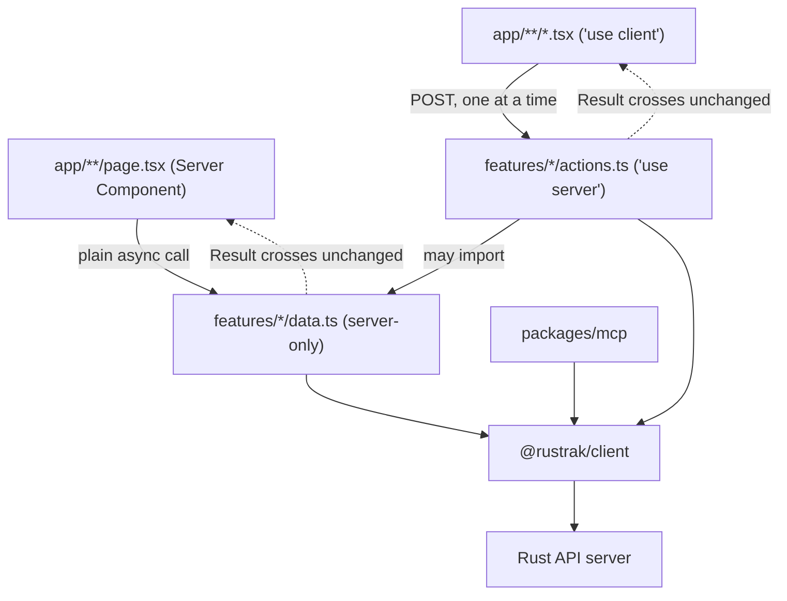
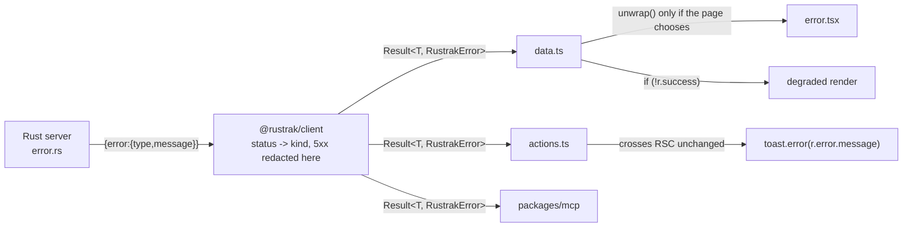

# Architecture Spine - Rustrak Frontend and Client Contract

## Design Paradigm

**Feature modules over a typed client. No layered architecture.**

`@rustrak/client` is the architectural boundary. It owns the API contract (Zod schemas), the transport implementation (ky), and the DTOs (~120 inferred types). Nothing in `apps/webview-ui` re-models, wraps, or inverts it. A hexagonal or clean-architecture split was evaluated in depth and rejected: with the contract, the implementation and the DTOs already inside a first-party, lockstep-versioned package, a `domain/` folder would hold re-exported client types and an `infrastructure/` folder would hold one-line delegations. Seven production Next.js App Router dashboards were cloned and inspected to test this; none has such a split.

`apps/webview-ui/src/` therefore has two axes and no third:

- **Feature on the outside.** `src/features/<module>/` per bounded context, one folder per module.
- **Role on the inside**, from a closed vocabulary: `data.ts`, `actions.ts`, `components/`, `hooks/`, and named files for derived logic.

There is no abstraction axis. Nothing in this codebase is defined by what it must not depend on, with one exception that is enforced by the compiler rather than by convention (AD-5).

`src/app/` contains routes and their page-local components. It composes; it does not fetch through indirection and it holds no derived logic.

## Invariants & Rules

### AD-1 - `@rustrak/client` returns `Result`, it does not throw

- **Binds:** all
- **Prevents:** every consumer having to discover at runtime which exceptions a method can raise, and the resulting mix of unguarded call sites and defensive `try/catch` that neither the compiler nor a reviewer can tell apart. Also prevents the class of bug in gh-204, where an exception crossing the React server/client boundary loses its message.
- **Rule:** every public method on every resource returns `Promise<Result<T, RustrakError>>`. A `throw` from the client is reserved for programming errors (malformed `baseUrl`, a bug in the client itself), never for an expected outcome. Expected outcomes are: any HTTP status the server can return, a transport failure, and a response that fails its own schema. This is a breaking change to a published package, taken deliberately while the product is pre-1.0.

### AD-2 - One `Result` type, a plain object, crossing every boundary unchanged

- **Binds:** all
- **Prevents:** a second result type appearing at the React boundary, and with it a conversion function, a mapping table, and two vocabularies for the same idea. Also prevents adopting a class-based result (`ts-results`, `ts-results-es`, `neverthrow`), which cannot cross that boundary at all: React checks the prototype and throws `"Only plain objects, and a few built-ins, can be passed to Client Components. Classes or null prototypes are not supported."`
- **Rule:** `Result<T, E>` is defined once in `@rustrak/client` as a plain discriminated union with no methods:

  ```ts
  export type Result<T, E> =
    | { readonly success: true;  readonly data: T }
    | { readonly success: false; readonly error: E };
  ```

  The discriminant is `success` and the payload is `data`, mirroring Zod's `safeParse` exactly, because the app runs Zod on every form and two near-identical shapes in one file is a defect. A method with nothing to return is `Result<void, E>` with `data: undefined`, never a bare `Result<never, E>` or a boolean. Operations on a `Result` are standalone exported functions (`Ok`, `Err`, `unwrap`, `unwrapOr`, `mapResult`), never methods. Every field is `readonly`. No value placed inside a `Result` may be a class instance or carry a non-`Object` prototype.

### AD-3 - Errors are one closed discriminated union, and 5xx never carries a server message

- **Binds:** all
- **Prevents:** three failures at once. A non-exhaustive error mapping, which the current client has (`transformHttpError` has a `default:` branch returning a bare error with only a status, silently swallowing 409 and 422 into an unhandled shape). A misleading name, which the current client also has (`ValidationError` means "our own response schema failed to parse", not "the user's input was rejected"). And internal detail reaching a user, which happens today because `apps/server/src/error.rs` serialises `self.to_string()` for every variant including `Database(#[from] sqlx::Error)`, putting column and constraint names in the HTTP body.
- **Rule:** `RustrakError` is a closed union keyed on `kind`, exported from `@rustrak/client`:

  ```ts
  export type RustrakError =
    // mirrors apps/server/src/error.rs AppError, verified variant by variant
    | { kind: 'validation';        status: number; message: string }  // AppError::Validation -> 400
    | { kind: 'unauthenticated';   status: number; message: string }  // 401
    | { kind: 'forbidden';         status: number; message: string }  // 403
    | { kind: 'not_found';         status: number; message: string }  // 404
    | { kind: 'conflict';          status: number; message: string }  // 409
    | { kind: 'gone';              status: number; message: string }  // 410, invitation flows
    | { kind: 'payload_too_large'; status: number; message: string }  // 413
    | { kind: 'rate_limited';      status: number; message: string; retryAfter?: number }
    | { kind: 'client_error';      status: number; message: string }  // any other 4xx
    // local and transport failures, no server status
    | { kind: 'invalid_request';   message: string }  // caller input rejected before the call
    | { kind: 'server_error';      status: number; message: string; incidentId?: string }
    | { kind: 'network';           message: string }
    | { kind: 'invalid_response';  message: string };
  ```

  The union **mirrors the server's `AppError` enum**, not a generic HTTP taxonomy. `AppError::Validation` maps to **400**, not 422, so there is no 422 member; `PayloadTooLarge` emits **413**; `410` is already branched on in the invitation flow. `status` is `number`, never a literal type, and `client_error` is the catch-all, so a status nobody anticipated has a home instead of being unrepresentable. `invalid_request` covers the 17 sites across 9 resources that validate the caller's own input before issuing a request; those never reach the network and have no status. **Any other I/O in `apps/webview-ui` uses this same union**, not an ad-hoc shape: `version-check.ts` fetches a GitHub Pages feed directly and must return `Result<UpdateInfo, RustrakError>` like everything else, so a caller never has to know which backend a failure came from. A non-JSON or unparseable error body maps to `client_error` or `server_error` by status with the generic message; it is never surfaced verbatim.

  **The nine existing error classes are deleted.** `RustrakError` is today an exported class and the base of a nine-class hierarchy re-exported from `packages/client/src/index.ts`, used as a runtime value in `packages/mcp/src/errors.ts`, in four `apps/webview-ui` action files, and in five `instanceof` branches in `apps/docs/content/sdks/client.mdx`. The name is reused for this union and the classes go, in one breaking change with no deprecation period. Every one of those call sites, the docs page, and `packages/client/README.md` (which ships to npm teaching the throwing API) are named deliverables of the change, not follow-up.

  Redaction happens **inside the client, at construction**, and is keyed on the `kind`, never on a status:

  - `server_error` discards the server's message entirely and substitutes a fixed generic string. The detail never reaches the client; the Rust server logs it and emits a correlation id, surfaced as `incidentId`.
  - `network` carries **no `cause`**. Node's undici cause strings embed the resolved address (`ConnectTimeoutError ... attempted address: 10.55.44.33:8081`), which would publish the internal API host and port to any browser.
  - `invalid_response` carries **no Zod issues**. A `ZodIssue` embeds the offending path and value, which is response data. Issues are logged where the parse fails and never cross the wire.

  Every consumer is therefore protected, including `packages/mcp` and any external installer, and the `error.rs` fix becomes defence in depth rather than the only barrier. Mapping from HTTP status to `kind` is keyed on the status code, never on a class or an `instanceof` check, and must be exhaustive over the union.

  **A domain-meaningful absence is not an error.** An empty list is `success: true` with an empty array; "no current user" is `success: true` with `data: null`. `success: false` is reserved for a failure to obtain an answer. This binds the six existing degraded-fallback functions (`getSessionSummary`, `getSessionTimeseries`, `getNewIssuesForRelease`, `getServerVersion`, `getUpdateInfo`, `getCurrentUser`), whose fallbacks are deliberate and are preserved by widening the success type rather than by catching. A widened success value must represent a REAL absence (`null`, `[]`, zero items) and never a fabricated one: today's `EMPTY_SESSION_SUMMARY` returns zeroes that render identically to a genuine all-zero window, which is a lie the type system cannot see. Where that distinction matters to the reader, absence is modelled explicitly as `data: null` rather than as a zeroed record. `getCurrentUser` is the sharpest case: its "null means logged out" contract gates auth across 32 server files, and a wrong branch there is invisible to both the compiler and `next build`.

### AD-4 - Throwing is a local decision, never a layer policy

- **Binds:** all of `apps/webview-ui`
- **Prevents:** a blanket rule in either direction. Making every layer throw reintroduces gh-204. Making nothing ever throw forfeits `error.tsx` as an automatic boundary for the 28 pages under `(main)` that rely on it.
- **Rule:** no module is designated as throwing or non-throwing. `data.ts` and `actions.ts` both return `Result`, and neither may contain a `try/catch` or a call to `unwrap`. A page or Server Component that wants a failure to reach its nearest `error.tsx` calls `unwrap(result)` at that call site, deliberately and locally. A page that wants a degraded render narrows with `if (!result.success)` instead. Because `Result` is a discriminated union, reading `.data` without narrowing is a compile error, so a forgotten check cannot produce a silently broken render.

  **`unwrap` is confined to `src/app/`**, machine-checked by rule (11). Calling it inside `actions.ts` would throw across the RSC boundary and reproduce gh-204 exactly, and rule (2) would not catch it, because rule (2) reads the declared return type and an action that throws still declares `Promise<Result<...>>`.

  `unwrap` throws a real `Error` subclass, never the plain union object: React error boundaries expect an `Error`, and a plain object would not reach `error.tsx` at all. The thrown instance carries the `RustrakError` on a property for server-side logging. React redacts its message on the way to the browser regardless, which is accepted: `error.tsx` is a "something went wrong" page, and the recoverable detail is the `incidentId`, not the message. Any `try/catch` elsewhere in `apps/webview-ui` must open with `unstable_rethrow(error)`, or it will swallow the `DynamicServerError` that `cookies()` raises during static generation, along with `redirect()` and `notFound()`.

### AD-5 - The direction of the call decides the file, and the compiler enforces it

- **Binds:** all of `apps/webview-ui`
- **Prevents:** every one of the 85 functions exported from the 18 `'use server'` files being **published as an HTTP endpoint any client can POST to**, when only those actually invoked from a browser event need to be. Marking a function `'use server'` registers a server reference and mints a stable action id; a read that only ever serves a Server Component gains nothing from that and pays for it in attack surface. Also prevents gh-204's two populations, the client-called and the server-called, drifting apart as a matter of discipline. (gh-204 states 81 actions against the 85 currently exported; the rule set produces the authoritative count as a side effect of running.)
- **Rule:** placement follows who initiates the call, not what the function does.

  | File | Directive | Initiated by | Endpoint published |
  | --- | --- | --- | --- |
  | `features/<module>/data.ts` | `import 'server-only'` | a Server Component render | no |
  | `features/<module>/actions.ts` | `'use server'` | a browser event | yes |

  `import 'server-only'` is not a directive; it is a build-time poison pill that makes inclusion in the client module graph a **compilation error**. It requires no dependency: Next.js 16 handles `server-only` and `client-only` internally and ships their type declarations, and the npm packages' contents are unused. The existing flat `src/actions/` directory is **deleted**, its 85 exports redistributed by the same test, who initiates the call: 33 are client-invoked, 40 are server-invoked, 10 are dead (nine `notification-channel` aliases plus `getTransactionSpans`) and are removed rather than migrated, each being a live accidental endpoint today. No `'use server'` directive survives anywhere outside `features/*/actions.ts`, machine-checked by rule (10). `actions.ts` may import `data.ts`; the reverse is forbidden. For the one function needed by both populations (`listTeam`), the implementation stays in `data.ts` and `actions.ts` declares its own thin async function delegating to it; this is sanctioned, not an exception. An action that reuses a read declares its own async function rather than re-exporting one. Whether a given re-export survives depends on which layer is checking (the SWC transform and the TypeScript plugin do not agree), so this is a convention held by rule (3), not an inference from the compiler.

### AD-6 - `src/app/` is routes and composition only

- **Binds:** `apps/webview-ui/src/app`
- **Prevents:** the current state, where 57 components sit beside their `page.tsx`, 54 of them with no containing folder of their own, and route folders accumulate files with no stated rule, so no one can tell a route-private component from one that should be shared.
- **Rule:** every folder directly under `app/` is a real route segment, a route group `(name)`, or a parallel-route slot `@name`. Page-local components are colocated flat beside `page.tsx` until a single route directory exceeds six of them, at which point they move to that route's `_components/`. A `_`-prefixed folder never sits at the bare `app/` root; the root route uses a route group instead. `app/` contains no `data.ts`, no `actions.ts`, and no derived logic. Every Route Handler lives under `app/api/`, which Next.js requires to the extent that a `route.ts` may not share a segment with a `page.tsx`. There are no Route Handlers today.

### AD-7 - Derived logic lives in its feature, static data does not live in `lib/`

- **Binds:** `apps/webview-ui/src`
- **Prevents:** the current `src/lib/`, where 215 lines of ported Sentry algorithms sit beside a 1370-line table of SDK snippets, and where a single business threshold (the 99 and 95 percent crash-free tiers) is duplicated across two formatting functions because neither has a home.
- **Rule:** a module's derived logic lives in a named file inside its feature (`features/events/stack-trace.ts`), never in a shared `lib/`. Admission test, applied per file: **does it run in a test runner with nothing mocked?** If yes it is derived logic and belongs to a feature. If no it is glue. `src/lib/` retains only genuinely cross-feature, non-domain helpers (`utils.ts`, `rustrak.ts`). Static data tables move to `src/content/`. A threshold or constant that carries business meaning is defined exactly once and imported, never restated in a second function.

### AD-8 - Reads go straight to the source from Server Components

- **Binds:** `apps/webview-ui`
- **Prevents:** the current pattern, where Server Components read through Server Actions. Next.js dispatches Server Actions **one at a time per client** and queues them, so using them for reads serialises requests, and the docs are explicit that a prerendered component fetching through a Route Handler **fails the build**.
- **Rule:** a Server Component calls its feature's `data.ts` directly as a plain async function. Reads never go through `'use server'`, never through a Route Handler, and never through a client-side fetch. Mutations initiated in the browser go through `actions.ts` and are followed by `router.refresh()`, the established idiom in 24 files.

### AD-9 - The rules above are machine-checked, and each check proves it can fail

- **Binds:** all
- **Prevents:** the rules decaying into documentation. Also prevents the specific failure that bit the reference project this design is adapted from, where two architecture rules passed vacuously for months because a library field silently had its extension stripped. A secondary and explicit goal: a failing named test is a deterministic signal an AI coding agent consumes and corrects against, where a linter warning tends to be sanded off.
- **Rule:** `apps/webview-ui` gains a test runner and an `src/__tests__/architecture/` suite, one file per concern, run by `pnpm test` and therefore by `pnpm ci` with no CI file changes. Every rule asserts **two** things: that the matched population exceeds a floor, and that the violation set is empty. The floor is a **specific expected count committed in the test**, never `> 0`, because a floor of zero-plus is itself vacuous: it passes when a glob typo matches one file out of eighty. When the real count changes, the floor is updated in the same commit as a deliberate act. A rule that cannot assert its population is not written, whatever the mechanism, and this holds even where the tool offers its own empty-test protection, because that protection is known not to cover predicate rules. Before a rule is trusted, a deliberate violating fixture is added, the suite is confirmed to fail with a clear message, and the fixture is removed; a rule that has never been seen to fail is not considered delivered. The rule set is deliberately smaller than the reference project's; see Consistency Conventions for the enumerated checks, the mechanism assigned to each, and what is knowingly left unchecked.

### AD-10 - The conversion lands behind a staging seam, never as one flip

- **Binds:** all
- **Prevents:** the only reading of AD-1 through AD-5 that is otherwise available: a single unreviewable commit touching 86 client methods, 349 client tests, 64 `packages/mcp` call sites and roughly 120 UI files at once. Turborepo places `packages/client` and `apps/webview-ui` in one build graph, so there is no green intermediate by default. Also prevents two agents migrating different features from producing mutually incompatible intermediate states.
- **Rule:** the conversion proceeds in ordered phases, each ending with `pnpm ci` green.
  1. **Enable the gate.** `apps/webview-ui` gains `test`, `lint`, `format:check` and `check-types` scripts and a vitest config. Until this lands the app has no CI gate but `next build`, so nothing after it is verifiable.
  2. **Realign the fixtures.** `packages/client` `tests/mocks/handlers.ts` carries 50 error responses, all 4xx, and **50 of 50 use the flat `{error:'...'}` shape while zero use the nested shape the server actually sends**. That mismatch is why gh-204's `[object Object]` bug survived a 97 percent-covered suite. Realigning the fixtures, and adding 5xx and `retryAfter` cases, is a prerequisite to trusting any later phase, not Deferred work.
  3. **Add the seam additively.** `Result`, the `RustrakError` union, and an internal `attempt<T>(promise): Promise<Result<T, RustrakError>>` are introduced alongside the existing behaviour. Throughout this phase the client still throws, but it throws an `Error` **subclass carrying the plain union on a property**, because ky's `beforeError` hook and React error boundaries both require a real `Error`. Both call styles work; nothing breaks.
  4. **Convert resource by resource**, each with its tests, each a reviewable commit.
  5. **Flip and delete.** Throwing is removed, the nine error classes are deleted, and `packages/mcp`, `apps/docs/content/sdks/client.mdx` and `packages/client/README.md` are updated in the same change.
  6. **Restructure `apps/webview-ui`** feature by feature, adding each architecture rule with its deliberately failing fixture as the rule's own feature lands.

  A phase may not begin before its predecessor is green. Structural migration (phase 6) never interleaves with contract migration (phases 3 to 5).

### AD-11 - Every action re-authorizes; being reachable is not being permitted

- **Binds:** `features/*/actions.ts`
- **Prevents:** AD-5 arguing from attack surface while leaving the 35 endpoints it deliberately keeps unguarded. A Server Action is a public POST endpoint whose arguments are attacker-controlled; the fact that the only UI that calls it is rendered behind an auth check proves nothing, because the endpoint is reachable without that UI.
- **Rule:** every exported action performs its own authentication and authorization against the session, on every call, regardless of what the calling component does. Render-time gating is not a security boundary. Ownership arguments that arrive as parameters (`projectId`, `issueId`, `teamId`) are verified against the session's own permissions, never trusted. In practice the Rust server is the enforcement point and the action's duty is to pass the session and to surface `unauthenticated` or `forbidden` faithfully rather than swallowing it; an action that reaches the server without the session is the defect this prevents.



## Consistency Conventions

| Concern | Convention |
| --- | --- |
| Result shape | `{ success: true; data: T } \| { success: false; error: E }`. Discriminant `success`, payload `data`, mirroring Zod `safeParse`. All fields `readonly`. Never a class. See AD-2. |
| Error shape | One closed union keyed on `kind`, defined once in `@rustrak/client`. No consumer invents an error string or a code. See AD-3. |
| Naming - files | kebab-case. Biome configures `useFilenamingConvention` at error level. **At the time this spine was written no script in the repo invoked Biome**: the root `lint` task fanned out to per-package `lint` scripts and only `apps/server` defined one, so the convention was unenforced in CI. AD-10 phase 1 closes that by adding `lint` and `format:check` to `apps/webview-ui`; from that phase on, this row describes something the pipeline actually enforces. Next.js special filenames are the standing exception. |
| Naming - role files | `data.ts` and `actions.ts` verbatim, in every feature. `actions.ts` is the near-universal name in the surveyed repos; `_lib/` and `_actions/` are not used anywhere and are not adopted here. |
| Naming - modules | One folder per bounded context, name matching the client resource where one exists. Collisions resolved once, here: `members` is per-project membership and `team` is the instance-wide roster; they stay separate modules. `transactions` is the module, `performance` is only a route segment. `agents` owns traces and spans. `alerts` is per-project rules; `integrations` is instance-wide credentials; the deprecated `notification-channel` vocabulary is removed, not aliased. `stats` is a cross-cutting module with no route of its own, as is `sessions`. |
| Derived logic vs glue | Admission test: does it run in a test runner with nothing mocked? See AD-7. |
| Static data | `src/content/`, not `src/lib/`. |
| Mutation feedback | `useTransition` plus `router.refresh()`. `useActionState` is not used: it types exactly one payload parameter, while the actions here are multi-argument and typed, and adopting it would force every action into a `FormData` bag or a curried wrapper. `ActionResult` is nonetheless a valid `useActionState` state, so a single form may adopt it later for progressive enhancement without changing anything global. |
| Forms | react-hook-form with a Zod resolver. A server error with no field goes to `setError('root.serverError', ...)`, which react-hook-form clears on the next submit and which cannot collide with a real field name. |
| Cross-feature imports | **Permitted, and one-directional per concept.** A concept has exactly one owning feature and others import from it: a project is owned by `projects` even though `stats`, `issues` and `releases` all render one. `features/a` importing `features/b` is legal; a cycle between two features is not, and is caught by the import-graph rule. A type used by two features lives with its owner, never duplicated. |
| Shared placement | Decided once, so a migrating agent does not have to. A file used by two or more features and carrying **no** business meaning goes to `src/lib/` (`clipboard.ts`, `utils.ts`). Carrying business meaning, it stays with its owning feature and others import it (`session-health.ts` splits: the crash-free thresholds to `features/sessions`, the overview period helpers to `features/stats`). A chart primitive goes to `components/charts/`, and its formatting helpers travel with it (`chart-format.ts`, whose nine importers are five chart primitives plus four call sites). A hook used by two or more features goes to `src/hooks/` (`use-mobile.ts`). A static table goes to `src/content/` **together with the lookup functions that read it**, since `platforms.ts` and `platform-snippets.ts` export both. Cookie helpers stay in `lib/rustrak.ts` beside `createClient`, because they exist only to serve it. |
| Observability | AD-3 destroys the 5xx message by design, so it must be recoverable elsewhere. `apps/server` logs the full error and emits a correlation id on every 5xx; `@rustrak/client` surfaces it as `incidentId` and the UI renders it beside the generic message (`"... (ref: a1b2c3)"`). `invalid_response` logs its Zod issues where the parse fails. Without this the redaction trades a leak for a blind spot. |
| Errors surfaced to users | `toast.error` with `error.message`, which is now always safe to render because AD-3 redacts at the source. Never `err.message` from a caught exception. |
| Layer enforcement | Machine-checked. `import 'server-only'` is the primary mechanism and is a build error, not a test. The test suite covers what the compiler cannot: **(1)** every file under `features/*/actions.ts` opens with `'use server'`; **(2)** every exported value declaration in `features/*/actions.ts` has a return type assignable to `Promise<Result<unknown, RustrakError>>`, which requires the TypeScript type checker and is the load-bearing rule, since a function that still throws has the wrong inferred return type; **(3)** no `'use server'` appears under any `data.ts`; **(4)** every `data.ts` opens with `import 'server-only'`; **(5)** `data.ts` never imports `actions.ts`; **(6)** `@rustrak/client` is imported only from `lib/rustrak.ts`, `data.ts` and `actions.ts`, type-only imports excepted; **(7)** no `success: false` object literal exists outside `@rustrak/client`, which retires the six-different-error-shapes problem; **(8)** every folder under `app/` is a route segment, a route group `(name)`, a parallel slot `@name`, or a private `_`-prefixed folder, and no `_` folder sits at the bare `app/` root (note the live violation at `app/(main)/settings/team/components/`, unprefixed, which must be renamed); **(9)** a runtime test asserting the client's exported error `kind` values equal an explicit allowlist, so a new variant fails a test in the release that introduces it rather than being silently unhandled; **(10)** no `'use server'` directive exists anywhere outside `features/*/actions.ts`; **(11)** no call to `unwrap` and no `try/catch` appears in any `data.ts` or `actions.ts`, and any `try/catch` elsewhere opens with `unstable_rethrow`. |
| Knowingly unchecked | Stated rather than pretended: whether a Client Component renders a message meaningfully; whether the semantically correct `kind` was chosen for a given status; whether the Rust server's 4xx bodies are free of internal detail, which is the server's to own. Deliberately **not** written: "no Server Component imports from `actions.ts`", because a page legitimately imports an action to forward it as a prop, and an import graph cannot distinguish calling from forwarding without dataflow analysis. Rule (2) makes it unnecessary. |
| Architecture-test tooling | `archunit` under vitest is the declared mechanism, complemented where it structurally cannot reach. Assignment: **archunit** owns the import-graph rules (5) and (6). The **TypeScript compiler API**, the project's own `typescript`, owns rule (2), which needs the type checker and which archunit's per-file predicate model (`path`, `name`, `content`, `linesOfCode`) cannot express at all. See the compiler-API row below for why this is not `ts-morph`: taking `ts-morph` would pull a second TypeScript version into the repo, and it does not support TypeScript 7. **`node:fs` walks** own rule (8), which is tree-shaped rather than per-file. Rules (1), (3), (4) and (7) may sit in either. Two archunit defects, both verified by reading its shipped 2.3.3 source and both still current, are mitigated rather than assumed away: `FileInfo.name` strips only the LAST extension, so `name.endsWith('.test.ts')` is never true and such a rule passes vacuously forever; and `allowEmptyTests` misfires on negative dependency rules, failing by default when nothing imports the target, which is the healthy state, forcing it off on exactly the rules that matter most. AD-9's population-floor assertion is the mitigation for both and is mandatory on every rule regardless of mechanism. Note also that archunit carries its own TypeScript 5.9.3 as a regular dependency while this project builds with 6.0.3, so its view of the code is a 5.9 parse; treat a rule that silently matches fewer files than expected as a parse failure, which the population floor will catch. |
| Dependency pinning | Exact versions, no caret or tilde, per standing repo policy. |
| Versioning | Lockstep across the release group. The `Result` change is a `minor` changeset, never `major`, per the 0.x convention. |

## Stack

| Name | Version |
| --- | --- |
| Next.js | 16.2.10 `[ADOPTED]` |
| React | 19.2.7 `[ADOPTED]` |
| TypeScript | 6.0.3 `[ADOPTED]` |
| Tailwind CSS | 4.3.2 `[ADOPTED]` |
| Zod | 4.4.3 `[ADOPTED]` |
| ky | 2.0.2 `[ADOPTED]`, sealed inside `@rustrak/client`. Already on ky 2 APIs (`isHTTPError`, `error.data`, `prefix`) |
| react-hook-form | 7.81.0 `[ADOPTED]` |
| Biome | 2.5.4 `[ADOPTED]`, monorepo root |
| vitest | 4.x, new to `apps/webview-ui`, matching `packages/client` and `packages/mcp`. Requires `test.globals: true` and `"types": ["vitest/globals"]` for archunit's `toPassAsync` matcher |
| archunit | 2.3.3, architecture tests only. Single maintainer, ~42k downloads/week; adopted deliberately for consistency with the reference project and for deterministic agent feedback, with the two defects named in Consistency Conventions mitigated |
| TypeScript compiler API | the project's own `typescript` 6.0.3, used directly for AD-9 rule (2). Preferred over `ts-morph` specifically to avoid a second TypeScript version: `ts-morph` 28.0.0 does not support TypeScript 7, which is already npm `latest`, and pinning it would couple the spine's load-bearing rule to an upgrade this repo will make. If `ts-morph` is used for ergonomics it is pinned exactly, per standing policy, never "latest at install" |
| `server-only` | not installed; Next.js 16 resolves it internally and ships its types |

## Structural Seed

### Target source tree

```text
apps/webview-ui/src/
  app/                                 # routes and composition only (AD-6)
    (main)/
      layout.tsx  error.tsx
      projects/[id]/issues/
        page.tsx                       # Server Component, calls features/issues/data.ts
        issues-list.tsx                # 'use client', calls features/issues/actions.ts
    global-error.tsx                   # NEW: nothing catches a root-layout throw today
  features/<module>/
    data.ts                            # import 'server-only'   -> Result, no endpoint
    actions.ts                         # 'use server'           -> Result, endpoint
    <derived>.ts                       # e.g. events/stack-trace.ts, events/event-schema.ts
    components/  hooks/
  lib/
    rustrak.ts                         # createClient, sole SDK construction site
    utils.ts                           # cn, formatBytes
  content/                             # platforms.ts, platform-snippets.ts (1887 lines of tables)
  components/{ui,charts,icons}/        # feature-agnostic primitives
  __tests__/architecture/              # one file per rule (AD-9)

packages/client/src/
  result.ts                            # Result<T,E> + Ok, Err, unwrap, unwrapOr, mapResult
  errors.ts                            # the RustrakError union + isRetryable
  resources/                           # 20 resources, every method returns Result
```

### Error contract, end to end



### Module set

`auth`, `projects`, `issues`, `events`, `logs`, `transactions`, `releases`, `sessions`, `agents`, `alerts`, `integrations`, `members`, `team`, `invitations`, `tokens`, `storage`, `stats`, `version`. `sourcemaps` exists in the client with no UI surface and gains no feature folder until it does.

## Deferred

- **Client-side data fetching.** Moving reads to the browser with react-query and a token-minting proxy route is what three of the surveyed repos do, but it is a re-platforming of the data flow rather than a reorganisation, and it cuts against gh-204's framing. Not decided here. The current all-server-side flow stands.
- **Cache Components.** `use cache`, `cacheTag` and `cacheLife` all require `cacheComponents: true`, which is off. A prerequisite is recorded rather than solved: a cached scope may not call `cookies()`, and `lib/rustrak.ts` `createClient()` awaits `cookies()` internally, so **no data path in this app can carry `use cache` until session acquisition is split from client construction**. When caching is adopted, the tag vocabulary needs a single named home, because it is the one contract spanning the read and write paths.
- **`apps/server/src/error.rs` internals.** Removing `self.to_string()` on `Database(#[from] sqlx::Error)` and emitting a correlation id on every 5xx. The correlation id is required by AD-3's Observability convention and is therefore in scope; the rest of the variant-by-variant cleanup is defence in depth, since AD-3 redacts inside the client. The client must accept both the nested `{error:{type,message}}` shape and the flat `{error:"..."}` shape the 429 path uses; `utils/http.ts` already handles both and already cites gh-204, so that part may be done.
- **Revisiting the no-layers decision.** Reopen if `@rustrak/client` ever needs to be swapped or dual-targeted, or if its release cadence decouples from the server's lockstep versioning. Both currently hold, and both are what make a port redundant.
- **`unstable_retry` and `unstable_catchError`.** `(main)/error.tsx` wires its retry button to `reset()`, which per the 16.2 docs re-renders without re-fetching, so it cannot recover a failed Server Component data fetch, which is the only kind of error this boundary sees; `unstable_retry` is the documented alternative. `unstable_catchError` (new in 16.2.0) would let a failed panel degrade in place instead of taking the page. Both are real fixes, neither is an architectural invariant.
- **Component tests.** AD-9 introduces the runner for architecture rules. Component and integration testing is a separate decision, noting that Vitest does not yet support async Server Components.
- **Sub-structuring `components/ui/`.** 21 primitives in one flat folder. No credible published guidance exists on a threshold; not a problem worth solving now.
- **`packages/mcp` migration detail.** Bound by AD-1 through AD-3 as a consumer, but its call-site changes are implementation work, not invariants.
