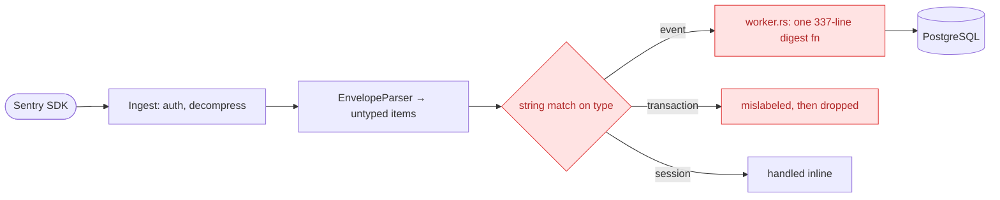
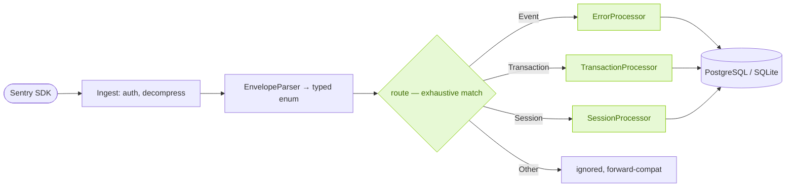

This refactor started with a small bug: transactions were showing up in the dashboard with the title **"Unknown"**.

## The one-line fix that wasn't enough

Rustrak ingests data using the Sentry envelope format, a stream of typed items: `event`, `transaction`, `session`, and so on. For a long time only error events mattered, so the ingestion handler took a shortcut:

```rust
if matches!(t, "event" | "transaction" | "security") && event_item.is_none() {
    event_item = Some(item);
}
```

Once we began handling performance data, that `matches!` pulled transactions into the error pipeline, where they were fingerprinted as if they were exceptions. A transaction has no exception to group on, so it fell through to an `"Unknown"` title.

The fix was one line:

```rust
if t == "event" && event_item.is_none() { ... }
```

It stopped the mislabeling, but it also silently dropped every transaction, so no performance data was stored at all. We had replaced a visible bug with an invisible one. That usually means the problem is the design, not the line of code.

## What the old pipeline looked like

The whole ingestion path went through a single async function, `digest::worker::process_event()`, about 337 lines of it, and dispatch was a string `match` spread across the handler. Sessions were handled inline. Transactions had nowhere to go. Anything new had to be added to the one function that already did everything.



There were three issues here:

1. **String dispatch is invisible to the compiler.** A typo or a missing case is a runtime problem, not a build error. The `"Unknown"` regression was one of these.
2. **One function owns every concern.** Source-map rewriting, grouping, issue creation, and alerts all lived in the same body. Adding transactions meant growing it further or branching around it.
3. **Item types aren't first-class.** An item was a slice of bytes plus a string. Nothing in the type system distinguished a transaction from an error.

## The fix: separate the data from the behavior

We rebuilt the core around an idea taken from Sentry's own ingestion service, [Relay](https://github.com/getsentry/relay): separate what an item *is* from what we *do* with it.

The parser now assigns a real Rust type to every item, once, at parse time:

```rust
pub enum EnvelopeItemKind {
    Event(Vec<u8>),
    Transaction(Vec<u8>),
    Session(SessionUpdate),
    Sessions(SessionAggregates),
    Other(String, Vec<u8>), // forward-compatible catch-all
}
```

Dispatch becomes a single, exhaustive `match`. There is exactly one place in the codebase where item types are routed, and the build fails if a variant has no destination:

```rust
pub fn route(item: &EnvelopeItemKind) -> Route {
    match item {
        EnvelopeItemKind::Event(_)       => Route::Error,
        EnvelopeItemKind::Transaction(_) => Route::Transaction,
        EnvelopeItemKind::Session(_) | EnvelopeItemKind::Sessions(_) => Route::Session,
        EnvelopeItemKind::Other(_, _)    => Route::Ignored,
    }
}
```

Each route lands on its own **processor**, an independent unit that implements one small trait:

```rust
pub trait Processor {
    type Input;
    fn process(&self, work: Self::Input, ctx: &ProcessorCtx)
        -> impl Future<Output = AppResult<()>> + Send;
}
```

`ErrorProcessor`, `TransactionProcessor`, and `SessionProcessor` each own their dependencies and their logic. The old 337-line function wasn't thrown away; it became the body of `ErrorProcessor`, while a registry built once at startup wires everything together.



## Why a trait, and not `dyn` or an `if` ladder

A few deliberate choices:

- **Static dispatch, no `dyn`.** Dispatch happens through generics, so the compiler monomorphizes and inlines each processor call. There's no vtable, no boxed future, and no per-event heap allocation on the hot path. This follows how Relay structures its processors.
- **Native `async fn` in traits.** We write the return type as `impl Future + Send` rather than using the `async-trait` crate. That keeps the futures allocation-free and `Send`, which is what `tokio::spawn` needs on the ingestion path.
- **The enum is pure data.** `EnvelopeItemKind` lives in the ingest layer and knows nothing about processors or databases. Routing is behavior, and it lives one layer up, so the enum stays testable without a database.

## How this helps us scale

The main benefit is what it costs to add the next event type, such as spans, check-ins, or profiles. The change surface is now small and fixed:

| Step | Change |
| --- | --- |
| Add the variant | `EnvelopeItemKind::Span(Vec<u8>)` |
| Add the route | one `match` arm in `route()` |
| Add the processor | a new `digest/processors/span.rs` |
| Register it | one field in the registry |

The compiler enforces the rest: if the `match` arm is missing, the build fails at that line. A string typo can no longer route a span into the error pipeline, and a new type can't be silently dropped. The class of bug behind the `"Unknown"` labels is now prevented by the type system rather than patched after the fact.

We shipped this backend-first, behind a clean processor boundary. Errors still flow through the durable two-phase path we [described in an earlier post](/blog/introducing-rustrak), transactions are stored directly, and sessions are aggregated, all through the same trait. The change ended up smaller than the code it replaced (a 337-line function removed and its logic redistributed), is fully tested, and was verified end-to-end with real SDK traffic.

A small mislabeling bug turned out to be a good reason to make the ingestion core easier to extend. The one-line fix would have hidden the problem; the refactor removed it.
